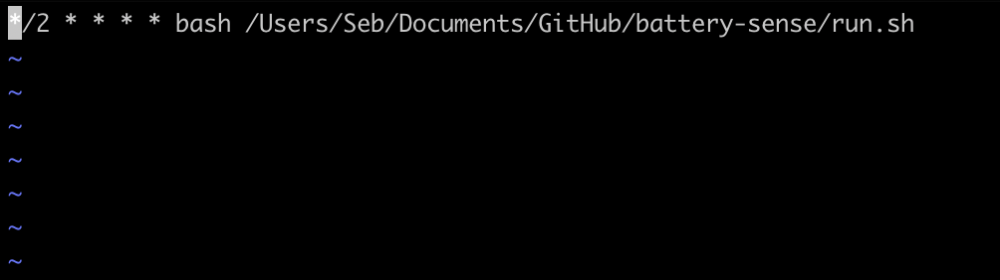

# Battery Status Logger

This is a python3 script intended to be run regularly (every 2 mins) as a cronjob on a mac/linux laptop system. It takes the battery percentage, estimated time left on battery and 'plugged in' status using the python psutil package, and pushes it to a Notion.so database using their new official API and the python requests package.

## Setup

First, create a directory and clone the repo:

```bash
mkdir <path of directory to create>
git clone https://github.com/sebhulse/battery-sense.git
```

Then create a .env file in that directory with your NOTION_AUTH (notion auth key) and NOTION_DB (notion database id) variables - [see the API docs](https://developers.notion.com/reference/intro):

```
NOTION_AUTH=<your_notion_auth_key_here>
NOTION_DB=<your_database_ID_here>
```

Open the run.sh script and insert the path to the battery-sense directory for the `cd` command.

```bash
# change this:
cd /<insert_path_here>/battery-sense
```

Test that the run.sh script works by just running it in the terminal in the directory before the cronjob is setup - you should see an entry to the notion database (if your battery is not at 100%!):

```bash
bash run.sh
```

On Mac, before we set up the conjob, we need to give `cron` and `python3` full disk access - do this by first navigating to Finder - Go - Go to Folder... and searching for the following:

```bash
/usr/sbin/cron
/usr/bin/python3
```

Then drag them to System Preferences - Security & Privacy - Privacy - Full Disk Access.

Note that the locations for cron and python3 may be different on your system. This is what you want to see in System Preferences - Security & Privacy - Privacy - Full Disk Access:


Now, we can set the cronjob up. Go to your root directory and open the cronjob editor:

```bash
cd ~
crontab -e
```

Now we need to insert the cron command into this file - make sure you change the path to the run.sh file. The `*/2 * * * *` portion is the cron time interval (2 minutes in this case, but you can change this to what suits you):

```bash
*/2 * * * * bash /<insert_path_here>/battery-sense/run.sh
```

So the cronjob file looks something like this (in VI):



Save the file change and quit with `:q` in VI.

Once the cronjob has run for the first time in the cron environment, it will have installed the necessary packages. After that, the pip commands in the run.sh file are obsolete and can be deleted - this should also improve the performance of the script. The run.sh script should now look something like this:

```bash
cd /<insert_path_here>/battery-sense

/usr/bin/python3 sense.py
```

All done! Now just wait and watch those notion database entries come rolling in every 2 minutes (so long as your battery percentage isn't at 100%!).
